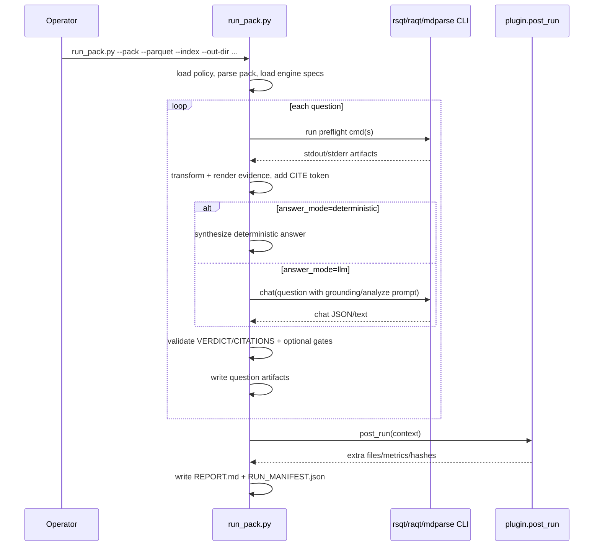

# Architecture

## Purpose
Explain how the FCDRAG runner composes deterministic evidence extraction, specialist prompting, validation gates, and artifacts.

## Audience
Engineers extending `run_pack.py`, writing plugins, or debugging run behavior.

## When to read this
Read after [README.md](README.md) and [FCDRAG.md](FCDRAG.md), before [EXTENDING_AND_PORTING.md](EXTENDING_AND_PORTING.md) and [PACK_AUTHORING.md](PACK_AUTHORING.md).

## System overview
The architecture is a configurable pipeline driven by:
- runner code: `run_pack.py`
- policy defaults and aliases: `runner_policy.yaml`
- engine wiring: `engine_specs.yaml`
- pack contract + preflights: `pack_*.yaml`
- optional post-run plugins: `plugins/*.py`

`run_pack.py` is intentionally generic; domain behavior is pushed to pack YAML and plugins.

## Topology fit (from `RAG_TOPOLOGIES.md`)
This architecture is FCDRAG, a composite topology:
1. Corrective RAG (`RAG_TOPOLOGIES.md:9`): validation and correction loops after generation.
2. Rule-Based RAG (`RAG_TOPOLOGIES.md:189`): explicit response/citation/path rules.
3. Iterative RAG (`RAG_TOPOLOGIES.md:213`): schema retry loop.
4. Adaptive RAG (`RAG_TOPOLOGIES.md:57`): adaptive retrieval depth (`top_k`) rerun path.

## Component diagram
```mermaid
flowchart LR
  A[Operator CLI\nuv run python run_pack.py] --> B[run_pack.py]
  B --> C[runner_policy.yaml\ndefaults + aliases]
  B --> D[engine_specs.yaml\nCLI mapping per engine]
  B --> E[pack_*.yaml\nquestions + preflights + validation]

  E --> F[Deterministic preflights\nrsqt/raqt/mdparse cmds]
  F --> G[Evidence blocks\nCITE tokens + render/transform]

  B --> H{Question answer_mode}
  H -->|deterministic| I[Deterministic seed answer\nor plugin synthesizer]
  H -->|llm| J[Engine chat call\n(grounding or analyze-only prompt)]

  G --> J
  I --> K[Schema/citation/path validation]
  J --> K

  K --> L[Artifacts\nREPORT.md + per-question files]
  L --> M[Plugin post_run hooks]
  M --> N[Plugin outputs\nFINDINGS / GURU report / metrics]
  L --> O[RUN_MANIFEST.json]
  N --> O
```

## Sequence of a run


## Key pipeline stages

### 1) Load and resolve config
- `runner_policy.yaml` is deep-merged onto built-in defaults.
- `RUNNER_POLICY_PATH` can override policy path.
- pack/parquet/index/engine_specs are resolved by cwd, script dir, repo root, then alias mapping.

### 2) Execute deterministic preflights
- Per-question `preflight[]` steps run first.
- `engine_override` can execute a step using another engine spec.
- Preflight artifacts are persisted as `<QID>_<step>.json`.
- Optional caching and short-circuiting apply.

### 3) Inject evidence into prompt
- Preflight artifacts become evidence blocks with `CITE=<QID>_<step>.json:1`.
- Render modes: `list | block | lines | json`.
- Transform filters can prune noise (`exclude_test_files`, `require_regex`, `group_by_path_top_n`, etc.).

### 4) Choose answer path
- `answer_mode=deterministic`: skip model answer call.
- `answer_mode=llm`: call engine chat with grounding prompt or analyze-only prompt depending on quote-bypass mode and evidence availability.
- `advice_mode=llm` can run a second, improvement-focused pass.

### 5) Validate output contract
- Schema validator enforces `VERDICT` and `CITATIONS` contract.
- Optional provenance gate checks citations appear in injected evidence.
- Optional path gates block unknown paths and uncited path mentions.
- Contract issues are written into `REPORT.md`; exit code can be `2` when fail-closed is enabled.

### 6) Emit artifacts and plugin outputs
Always produced:
- `REPORT.md`
- `RUN_MANIFEST.json`
- per-question files (`*_augmented_prompt.md`, `*_chat.json`, preflight artifacts)

Conditionally produced:
- `*_bypass_prompt.md` (quote-bypass path)
- `*_advice_prompt.md` and `*_advice_chat.json` (`advice_mode=llm`)
- replicate summaries (`STABILITY_SUMMARY.md`, optional `GURU_STABILITY_SUMMARY.md`)
- plugin outputs (for `rsqt_guru`): `FINDINGS.jsonl`, `EVIDENCE_INDEX.json`, `GURU_AUDIT_REPORT.md`, `GURU_METRICS.json`

## Boundaries and UNKNOWNs
- Runner does not define parquet internal schemas; it forwards parquet/index paths to engines.
- No mdparse-specific plugin is present in `plugins/`; docs pack usually sets `runner.plugin: none`. Extra domain outputs for mdparse are therefore `UNKNOWN/NOT FOUND` unless a plugin is added.

## Related docs
- FCDRAG explainer: [FCDRAG.md](FCDRAG.md)
- Concepts: [CONCEPTS.md](CONCEPTS.md)
- Data/chunking: [DATA_MODEL_PARQUET_AND_CHUNKING.md](DATA_MODEL_PARQUET_AND_CHUNKING.md)
- Pack schema: [PACK_AUTHORING.md](PACK_AUTHORING.md)
- Extension points: [EXTENDING_AND_PORTING.md](EXTENDING_AND_PORTING.md)

## Source anchors
- `RAG_TOPOLOGIES.md:9`
- `RAG_TOPOLOGIES.md:57`
- `RAG_TOPOLOGIES.md:189`
- `RAG_TOPOLOGIES.md:213`
- `run_pack.py:2103`
- `run_pack.py:2167`
- `run_pack.py:2234`
- `run_pack.py:2370`
- `run_pack.py:2397`
- `run_pack.py:2541`
- `run_pack.py:2618`
- `run_pack.py:2642`
- `runner_policy.yaml:1`
- `engine_specs.yaml:1`
- `plugins/base.py:26`
- `plugins/rsqt_guru.py:2690`
- `plugins/rsqt_guru.py:2922`
- `docs_audit_pack.explicit.yaml:485`
